# Yahoo Finance Stock Market Performance Case Study

## Project Overview

This project provides a comprehensive analysis of stock market performance for four major technology companies using data from Yahoo Finance. The analysis covers Apple (AAPL), Microsoft (MSFT), Netflix (NFLX), and Google (GOOG) over a three-month period.

## Objectives

The main objectives of this case study are to:

1. **Analyze stock price trends** - Identify patterns and movements in historical stock prices
2. **Calculate moving averages** - Compute 10-day and 20-day moving averages for price forecasting
3. **Measure volatility** - Assess the risk level and price fluctuation for each stock
4. **Perform correlation analysis** - Examine relationships between different stock prices

## Technologies Used

- **Python 3.x**
- **pandas** - Data manipulation and analysis
- **numpy** - Numerical computations
- **yfinance** - Yahoo Finance API for fetching stock data
- **plotly** - Interactive data visualizations
- **Jupyter Notebook** - Interactive development environment

## Project Structure

```
Yahoo-Finance-Stock-Market-Performance-Case-Study/
├── README.md
└── Yahoo_Finance_Stock_Market_Performance_Case_Study.ipynb
```

## Getting Started

### Prerequisites

Make sure you have Python 3.x installed on your system. You can download it from [python.org](https://www.python.org/).

### Installation

1. Clone the repository:
   ```bash
   git clone https://github.com/NusratBegum/Yahoo-Finance-Stock-Market-Performance-Case-Study.git
   cd Yahoo-Finance-Stock-Market-Performance-Case-Study
   ```

2. Install required dependencies:
   ```bash
   pip install numpy pandas yfinance plotly jupyter
   ```

### Running the Analysis

1. Launch Jupyter Notebook:
   ```bash
   jupyter notebook
   ```

2. Open `Yahoo_Finance_Stock_Market_Performance_Case_Study.ipynb` in your browser

3. Run all cells to execute the analysis

Alternatively, you can open the notebook directly in [Google Colab](https://colab.research.google.com/) using the badge in the notebook.

## Analysis Features

### 1. Data Collection

The project fetches historical stock data for the last 3 months and downloads data for AAPL, MSFT, NFLX, and GOOG using the yfinance API.

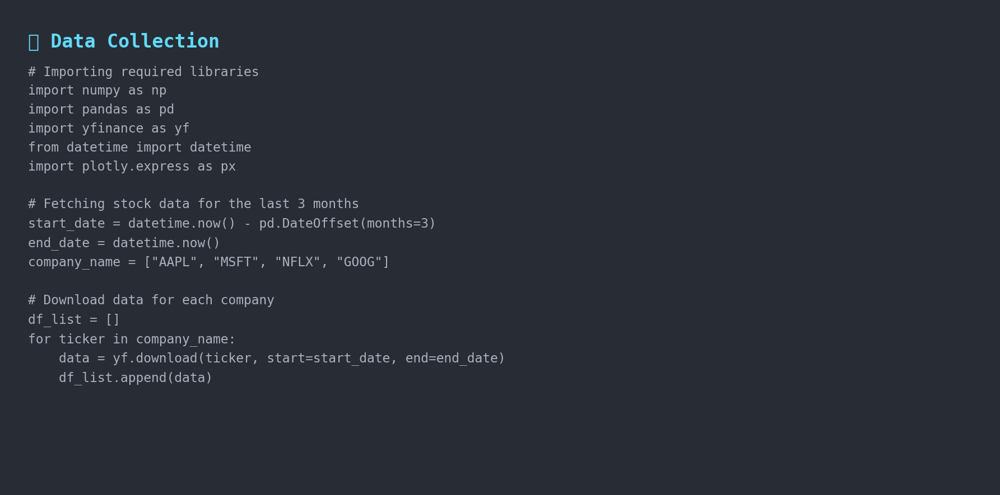

**Sample Data Preview:**


### 2. Data Processing

The data processing pipeline concatenates data from multiple companies, cleans and structures it for analysis, and resets indices for easier manipulation.

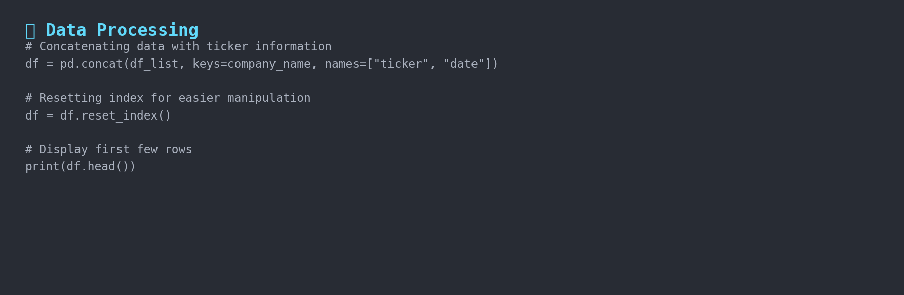

### 3. Visualizations

#### Stock Price Trends

Interactive visualizations showing daily closing prices with line charts and area charts with faceted views for each company.

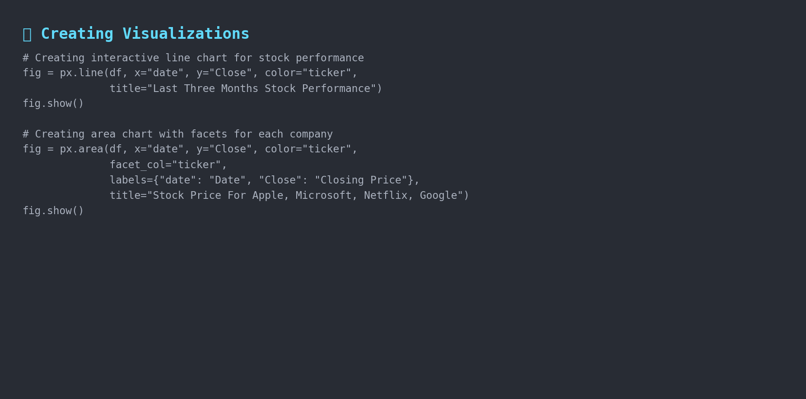

**Stock Performance Overview:**

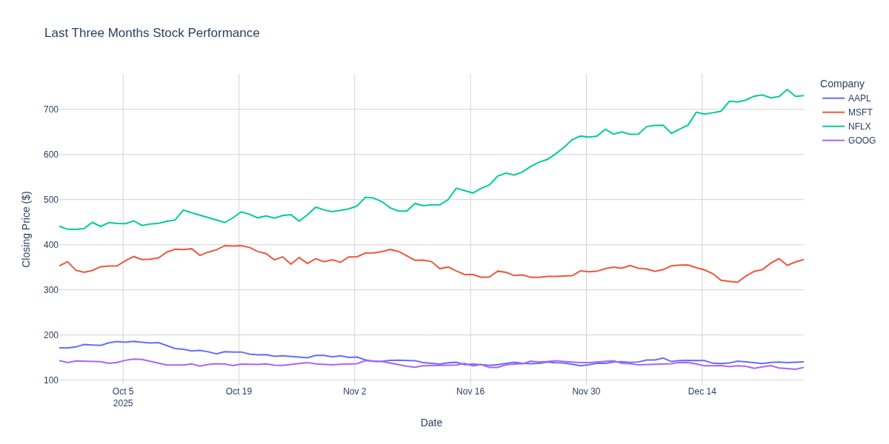

**Individual Company Stock Prices:**

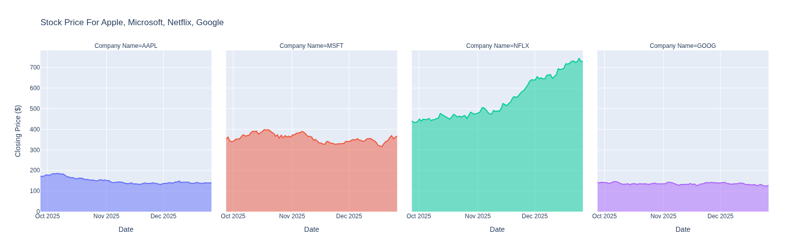

#### Moving Averages

The analysis calculates 10-day moving average (MA10) and 20-day moving average (MA20) for price forecasting, with comparison charts for each stock.


**Moving Average Analysis Results:**

<details>
<summary>Apple (AAPL) Moving Averages</summary>

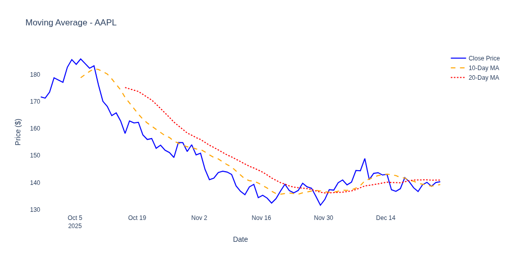
</details>

<details>
<summary>Microsoft (MSFT) Moving Averages</summary>

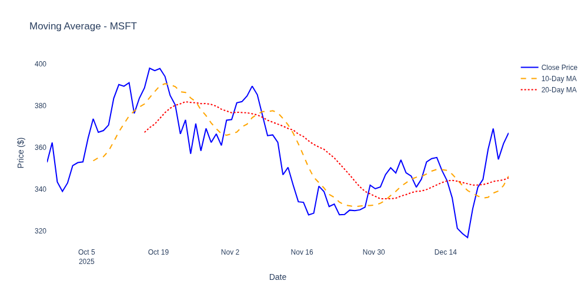
</details>

<details>
<summary>Netflix (NFLX) Moving Averages</summary>

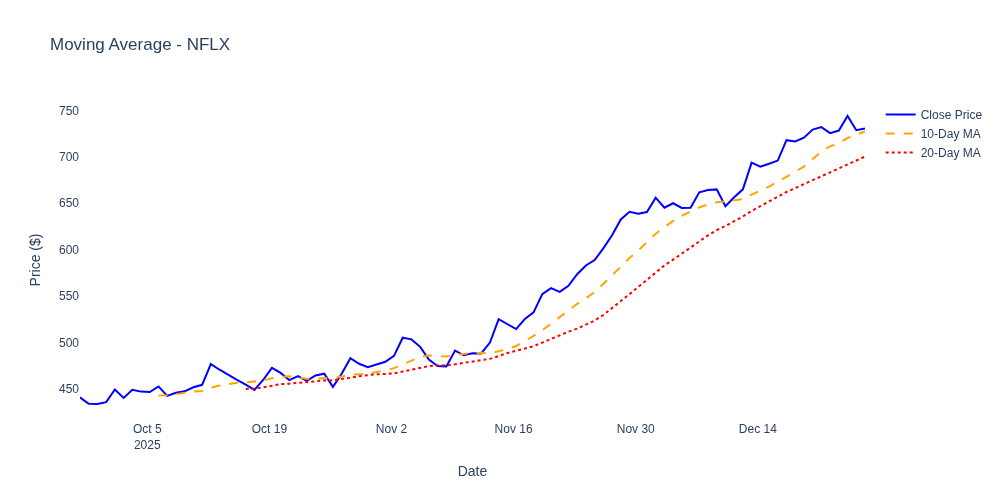
</details>

<details>
<summary>Google (GOOG) Moving Averages</summary>

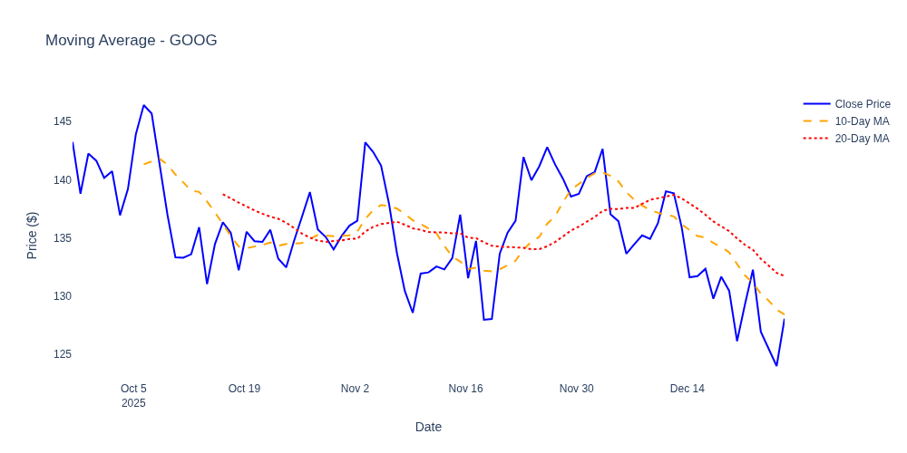
</details>

#### Volatility Analysis

Rolling window volatility calculations provide risk assessment and comparative volatility visualization across all companies.

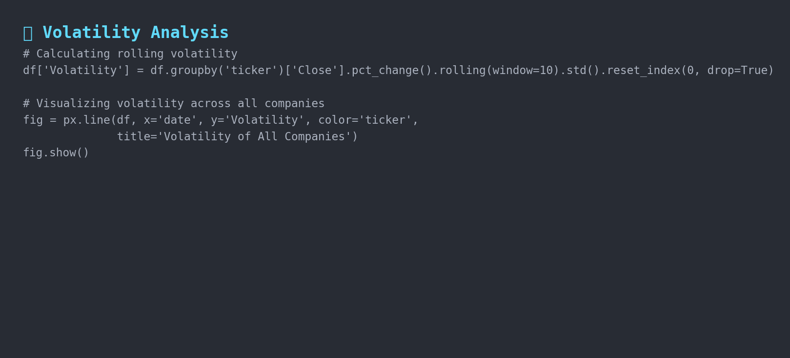

**Volatility Comparison:**

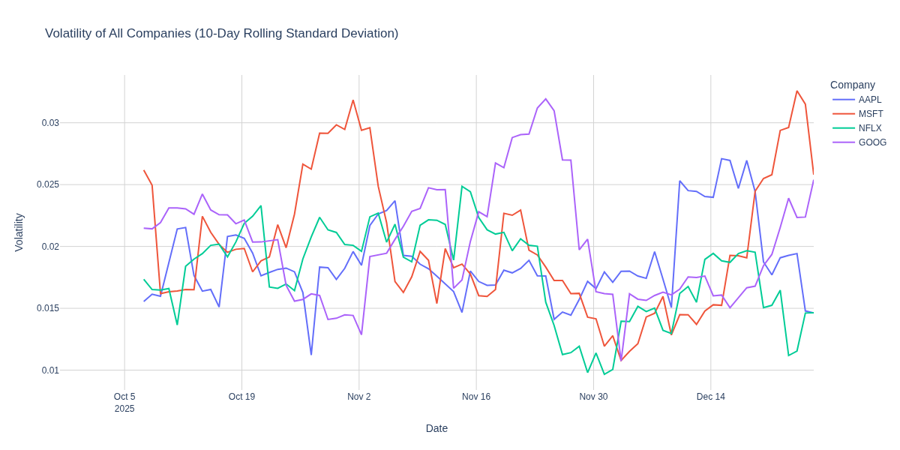

#### Correlation Analysis

The analysis examines relationships between different stock prices using scatter plots with OLS (Ordinary Least Squares) regression trend lines.

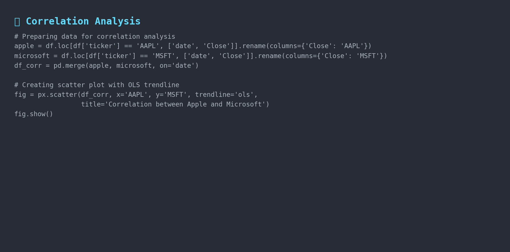

**Apple vs Microsoft Correlation:**

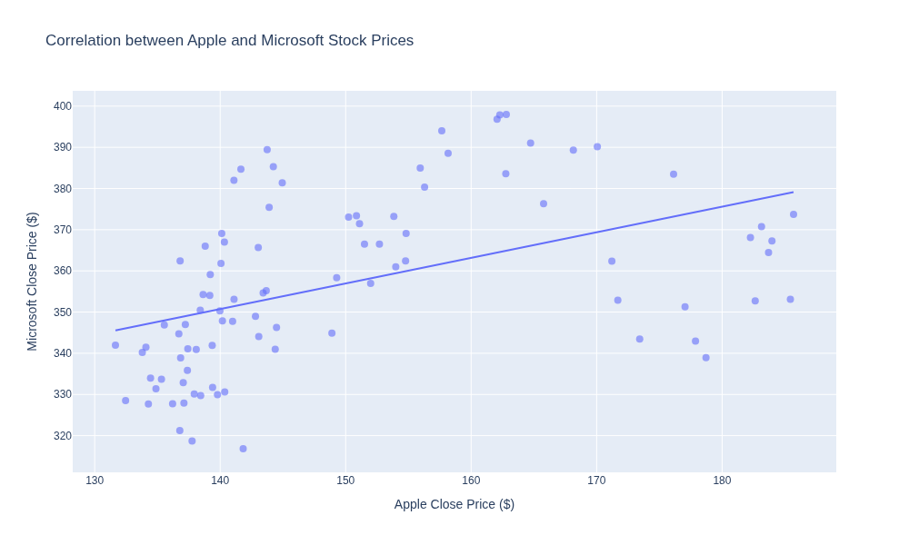

**Netflix vs Google Correlation:**

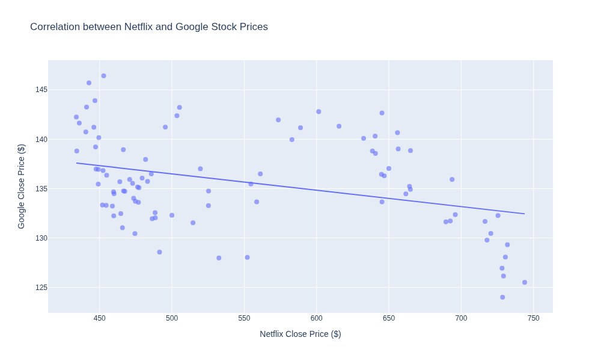

## Key Insights

The notebook provides insights into:
- Which stocks show the strongest upward or downward trends
- How moving averages can help predict future price movements
- The volatility levels of each stock (risk assessment)
- Correlations between different tech stocks (portfolio diversification insights)

## Contributing

Contributions, issues, and feature requests are welcome! Feel free to check the [issues page](https://github.com/NusratBegum/Yahoo-Finance-Stock-Market-Performance-Case-Study/issues).

## License

This project is available for educational and research purposes.

## Author

**Nusrat Begum**
- GitHub: [@NusratBegum](https://github.com/NusratBegum)

## Acknowledgments

- Yahoo Finance for providing the stock market data API
- Plotly for interactive visualization capabilities
- The Python data science community for excellent libraries